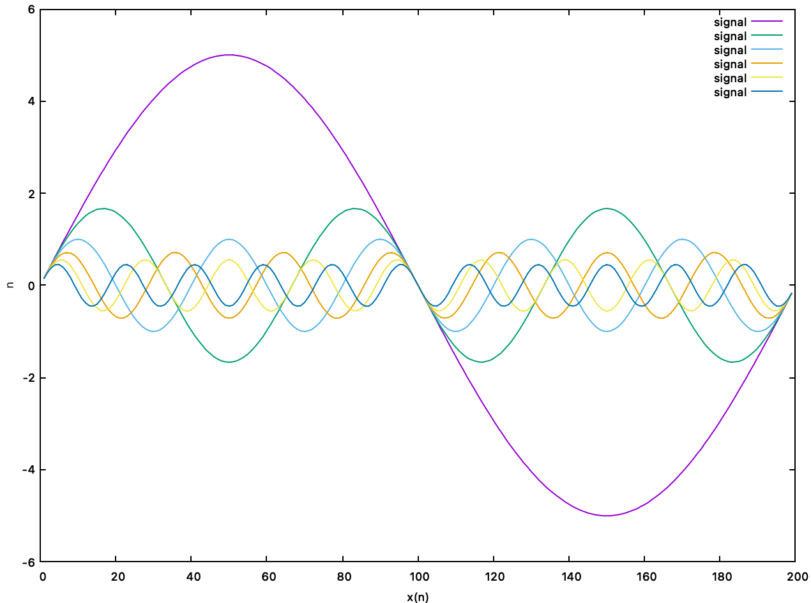
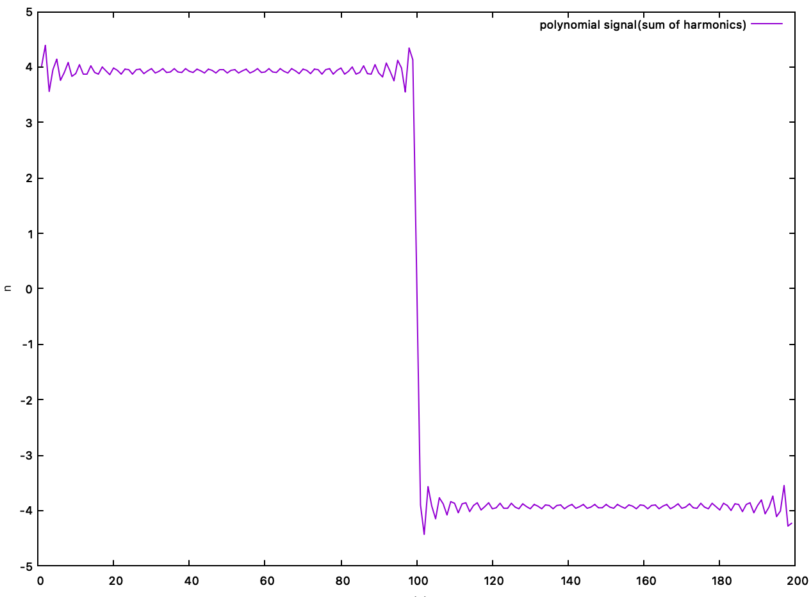
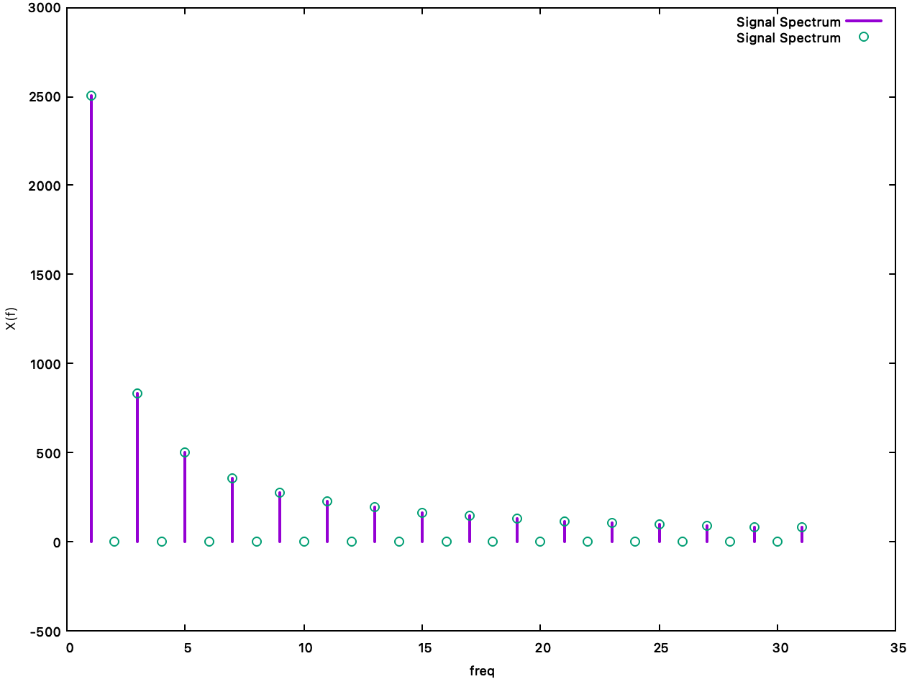

# filtering(2021.04.22)

## harmonics

```c++
#include <stdlib.h>
#include <stdio.h>
#include <math.h>

// Converting to radian
#define PI 3.14
float radian(float angle) { return (angle * PI) / 180; }
// sampling frequency
#define F 200
// sampling period
#define T 1/F
// amplitude
#define A 5.0
//number of harmonics
#define H	32//16

int main()
{
	FILE* file_out1;
	file_out1 = fopen("out.txt", "w");

	//signal generation
	float harmonics[H][F];
	float polynomial[F];

	for(int i=0; i<F; i++)	//샘플링...200개
	{
		fprintf(file_out1, "%d", i);
		int hi = 1;								//frequency : 주파수 성분
		polynomial[i] = 0;				//신호의 합
		for(int j=0; j<H; j++)		//주파수 성분에 따른 harmonics(주파수에 따른 신호)
		{
      //주파수 성분에 따라 생성
			float signal = (float)(A/hi) * sin(2 * PI * hi * T * i);
			harmonics[j][i] = signal;		//signal dump, 주파수별 신호 저장
			polynomial[i] = polynomial[i] + signal;		//신호의 합성
			hi += 2;		//주파수 변화시켜줌
		}
	}

	//plot
	for(int i=0; i<F; i++)
	{
		fprintf(file_out1, "%d", i);
		int hi = 1;			//frequency
		float sum = 0;
		fprintf(file_out1, "\t%.2f", polynomial[i]);
#ifdef	DEBUG
		for(int j=0; j<H; j++)
		{
			float signal = harmonics[j][i];
			sum = sum + signal;
			fprintf(file_out1, "\t%.2f", signal);
			hi += 2;
		}
#endif
		fprintf(file_out1, "\n");
	}
	
	fclose(file_out1);
	
	return 0;
}
```

```makefile
clean:
	rm -rf output/filter
all:
	(cd codes;		make all)
	(cd output;		./filter)
	(cd output;		gnuplot bar.bat)	#gnuplot을 이용하여 그래프를 출력
```

```makefile
#bar.bat
set xlabel	"x(n)"	# x 축 이름 설정
set ylabel	"n"			# y 축 이름 설정

plot	"out.txt" using 1:2 title "polynomial signal(sum of harmonics)" with lines
# plot을 만드는데 out.txt파일을 참조
# x축은 1열, y축은 2열, 그래프의 이름은 polynomial signal

pause mouse any "Any key or button will terminate window"
```

```makefile
#원 신호 출력
set xlabel	"x(n)"
set ylabel	"n"

plot    "out.txt" using 1:3 title "signal" with lines, \
        "out.txt" using 1:4 title "signal" with lines, \
        "out.txt" using 1:5 title "signal" with lines, \
        "out.txt" using 1:6 title "signal" with lines, \
        "out.txt" using 1:7 title "signal" with lines, \
        "out.txt" using 1:8 title "signal" with lines

pause mouse any "Any key or button will terminate window"
```

- 다양한 신호를 생성하고 이를 UI 상에서 그래프로 확인
- (A/hi) * sin(2 * PI * hi * T * i)
  - A : 진폭, 신호에 따라 진폭의 크기를 달리하기 위해 hi 값을 나눔
  - hi : 주파수 값
  - T : 샘플링 주파수


### 결과



- 주파수와 진폭에 따라 변화하는 신호들의 출력



- 모든 신호를 합치게 되면 그림과 같이 구형파에 가까운 형태를 가짐


## frequency analysis

```c++
#include <stdlib.h>
#include <stdio.h>
#include <math.h>
// Converting to radian
#define PI 3.14
float radian(float angle) { return (angle * PI) / 180; }
// sampling frequency
#define F 200
// sampling period
#define T 1/F
// amplitude
#define A 5.0
//number of harmonics
#define H	32//16

int main()
{
	FILE* file_out1;
	file_out1 = fopen("out.txt", "w");

	//signal generation
	float harmonics[H][F];
	float polynomial[F];

	for(int i=0; i<F; i++)
	{
		fprintf(file_out1, "%d", i);
		int hi = 1;			//frequency
		float sum = 0;
		polynomial[i] = 0;
//			fprintf(file_out1, "\t%.2f\n", signal);
		for(int j=0; j<H; j++)
		{
			float signal = (float)(A/hi) * sin(2 * PI * hi * T * i);	//
			harmonics[j][i] = signal;	//signal dump
			polynomial[i] = polynomial[i] + signal;
			hi += 2;
		}
	}

	//signal processing...
	//ex.. fourier transform...
	//the given polynomial signal includes a specific frequency component...
	float freq_component[H] = {0,};
	for(int i=0; i<H; i++)
	{
		for(int j=0; j<F; j++)
		{
			float probe = (float)(A) * sin(2 * PI * i * T *j /* + n*/);	
      //+ 항목은 쉬프트
			freq_component[i] += polynomial[j] * probe;
		}
	}

	for(int i=0; i<H; i++)
	{
		printf("%dHz component : %.1f\n", i, freq_component[i]);
		fprintf(file_out1, "%d\t%.1f\n", i, freq_component[i]); 
	}

	fclose(file_out1);
	
	return 0;
}
```

```makefile
#bar.bat
set xlabel	"freq"
set ylabel	"X(f)"

# 그래프를 그리는데, impulse 형태로 그림
# 지점에 포인트를 그림(원형)
# w : with
plot	"out.txt" using 1:2 title "Signal Spectrum" w impulses lw 2, \
		"out.txt" using 1:2 title "Signal Spectrum" w p pt 6

pause mouse any "Any key or button will terminate window"
```

- 주파수 변화에 따른 신호를 생성하고

- 이를 합한 신호를 기반으로 

- 푸리에 트랜스폼을 실행하여 합한 신호의 신호 성분을 확인

- ```c++
  for(int i=0; i<F; i++)
    for(int j=0; j<H; j++)
  		float signal = (float)(A/hi) * sin(2 * PI * hi * T * i);	//
  
  	for(int i=0; i<H; i++)		//32 : 0hz - 32hz
  	{
  		for(int j=0; j<F; j++)	//200, 샘플링
  		{
  			float probe = (float)(A) * sin(2 * PI * i * T *j /* + n*/);	
        //+ 항목은 쉬프트
  			freq_component[i] += polynomial[j] * probe;
  		}
  	}
  ```

- Polynomial[j]의 값과 probe 값을 곱하고 이를 누적

- 검출하고자하는 값 probe의 값을 가지고 있을 경우 freq_component는 값을 가짐

- probe 값과 일치하지 않는 값은 0에 가까운 값을 가짐


### 결과



- 해당 주파수에서 impulse 형태의 신호가 출력된다는 것은 
- 입력된 신호에 해당 주파수 성분을 가지고 있음을 의미