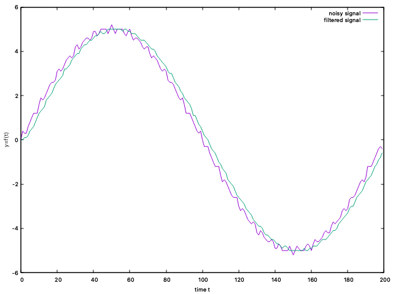

# noise Cancelling

## signal processing


- 다양한 신호가 합쳐진 원 신호
- 원 신호에서 불필요한 신호를 제거하기 위해 convolution 필터 적용
- 불필요한 노이즈를 줄이기 위한 convolution 시스템 값인 coefficient 값을 구할 필요가 있음
  - 기존에는 coefficient 값은 수식적 구할 필요가 있었음
  - 이를 보완하는 것이 딥러닝 기법
  - 원하는 신호를 목표로 놓고 수많은 샘플 신호를 바탕으로 coefficient 값을 무수히 변경하면서 최적의 coefficient 값을 찾아감
- Detector 과정에서 입력되는 신호로부터 원하는 주파수 대역의 신호 검출을 시도하고 해당 주파수 대역의 신호가 있다면 출력을 통해 해당 신호가 있음을 확인할 수 있음

## noise cancelling


- 검출하고자 하는 신호와 노이즈가 합쳐져 있는 원 신호
- 노이즈의 주파수를 알고 있다면 detector를 통해 입력되는 원 신호에 해당 노이즈의 여부를 확인할 수 있음
  - 노이즈의 주파수를 알 수 있는 방법은 별도로 있음
- 해당 주파수 대역의 노이즈를 제거하기 위해 같은 진폭과 주파수 값을 가지는 신호를 180°만큼 Phase Shift
- phase shift된 신호를 노이즈가 포함된 원 신호에 합치게 되면 진폭 차이에 의해 원 신호에 포함된 노이즈 신호는 제거되게 됨

## smoothing

### 소스코드

```c++
#include <stdlib.h>
#include <stdio.h>
#include <math.h>
// Converting to radian
#define PI 3.14
float radian(float angle) { return (angle * PI) / 180; }
// sampling frequency
#define F 200
// sampling period
#define T 1/F
// amplitude
#define A 5.0
//number of harmonics
#define H	32//16

extern void convolution(float h[], int len_h, float x[], int len_x, float* y, int len_y);

int main()
{
	FILE* file_out1;
	file_out1 = fopen("out.txt", "w");

	//signal generation
  //임의의 신호를 생성
	float harmonics[H][F];
	float polynomial[F];
	for(int i=0; i<F; i++)
	{
		int hi = 1;			//frequency
		float sum = 0;
		polynomial[i] = 0;
		for(int j=0; j<H; j++)
		{
			float signal = (float)(A/hi) * sin(2 * PI * hi * T * i);
			harmonics[j][i] = signal;	//signal dump
			hi += 2;
		}
	}

	// selective signal accumulation (interferenced from external signal)
  //위에서 임의로 생성한 신호를 합성
	for(int i=0; i<F; i++)
	{
		polynomial[i] = harmonics[0][i] + harmonics[20][i] + harmonics[10][i];
	}

	// convolution -- smoothing
	float h[] = {0.1, 0.1, 0.2, 0.2, 0.4};
	int len_h = 5;
	int len_x = F;
	int len_y = len_h + len_x -1;	//11
	float *y = (float*)malloc(sizeof(float) * len_y);

	for(int i=0; i<len_y; i++)
	{
		y[i] = 0.0;
	}

  //시스템 값 h를 기반으로 입력되는 신호의 노이즈를 최소화하고 평탄화함
	convolution(h, len_h, polynomial, len_x, y, len_y);
	
	for(int i=0; i<F; i++)
	{
		fprintf(file_out1, "%d\t%.1f\t%.1f\n", i, polynomial[i], y[i]); 
	}

	puts("");
	free(y);
	fclose(file_out1);
	
	return 0;
}
```

### 결과


- 노이즈가 포함된 신호를 convolution함에 따라
- 튀던 값들이 다소 스무스해진 것을 그래프 상에서 확인할 수 있음


## 특정 신호 제거

### 소스코드

```c++
int main()
{
	FILE* file_out1;
	file_out1 = fopen("out.txt", "w");

	//signal generation
	float harmonics[H][F];
	float polynomial[F];

	for(int i=0; i<F; i++)
	{
		int hi = 1;			//frequency
		float sum = 0;
		polynomial[i] = 0;
		for(int j=0; j<H; j++)
		{
			float signal = (float)(A/hi) * sin(2 * PI * hi * T * i);	//
			harmonics[j][i] = signal;	//signal dump
			hi += 2;
		}
	}

	// selective signal accumulation (interferenced from external signal)
	for(int i=0; i<F; i++)
	{
		polynomial[i] = harmonics[0][i];
	}

	// identify the freq components in the given noisy signal
	float freq_component = 0;
	int probe_freq = 1;	//7hz
	for(int i=0; i<F; i++)
	{
		float probe = (float)(A) * sin(2 * PI * probe_freq * T * i);
		freq_component += polynomial[i] * probe;
	}
	printf("%dhz component is %.3f\n", probe_freq, freq_component);

	//compoensate
	float K = A/probe_freq;		//you have to search this parameter
	float reversedNoise[F];
	float probe_result[F];
	for(int i=0; i<F; i++)
	{
		reversedNoise[i] = (float)(K) * sin(2 * PI * probe_freq * T * i + PI); 
		probe_result[i] = polynomial[i] + reversedNoise[i];	//180 degree delay
	}	

	for(int i=0; i<F; i++)
	{
		fprintf(file_out1, "%d\t%.1f\t%.1f\n", i, polynomial[i], reversedNoise[i]); 
	}

	puts("");
	fclose(file_out1);
	
	return 0;
}
```

### 결과


- 해당 그래프는 원 신호인 1hz의 신호를 캔슬링하기 위해
- 해당 신호를 180도만큼 딜레이 시켜본 결과


- 원 신호와 캔슬링 신호가 합쳐짐에 따라 신호가 사라진 것을 확인할 수 있음


### 소스코드

```c++
	for(int i=0; i<F; i++)
	{
		polynomial[i] = harmonics[0][i] + harmonics[10][i] + harmonics[20][i];
	}
```

### 결과


- 3개의 신호를 합성하고 
- 그중 10번째 신호인 21hz의 신호를 제거

## 노이즈 제거

### 소스코드

```c++
#include <stdlib.h>
#include <stdio.h>
#include <math.h>
// Converting to radian
#define PI 3.14
float radian(float angle) { return (angle * PI) / 180; }
// sampling frequency
#define F 200
// sampling period
#define T 1/F
// amplitude
#define A 5.0
//number of harmonics
#define H	32//16

extern void convolution(float h[], int len_h, float x[], int len_x, float* y, int len_y);

int main()
{
	FILE* file_out1;
	file_out1 = fopen("out.txt", "w");

	//signal generation
  //신호 생성
	float harmonics[H][F];
	float polynomial[F];
	for(int i=0; i<F; i++)
	{
		int hi = 1;			//frequency
		float sum = 0;
		polynomial[i] = 0;
		for(int j=0; j<H; j++)
		{
			float signal = (float)(A/hi) * sin(2 * PI * hi * T * i);	//
			harmonics[j][i] = signal;	//signal dump
			hi += 2;
		}
	}

	// selective signal accumulation (interferenced from external signal)
  //신호 합성
	for(int i=0; i<F; i++)
	{
		polynomial[i] = harmonics[0][i] + harmonics[10][i] + harmonics[20][i] + harmonics[30][i];
	}

	// identify the freq components in the given noisy signal
	float freq_component = 0;
	int probe_freq = 21;
	for(int i=0; i<F; i++)
	{
		float probe = (float)(A) * sin(2 * PI * probe_freq * T * i );
		freq_component += polynomial[i] * probe;
	}
	printf("%dhz component is %.3f\n", probe_freq, freq_component);

	//compoensate
  //특정 노이즈 제거
	float K = A/probe_freq;		//you have to search this parameter
	for(int i=0; i<F; i++)
	{
		polynomial[i] += (float)(K) * sin(2 * PI * probe_freq * T * i + PI);	//180 degree delay
	}

  //광범위 노이즈 제거
	float h[] = {0.1, 0.1, 0.2, 0.2, 0.4};
	int len_h = 5;
	int len_x = F;
	int len_y = len_h + len_x -1;	//11
	float *y = (float*)malloc(sizeof(float) * len_y);

	for(int i=0; i<len_y; i++)
	{
		y[i] = 0.0;
	}

	convolution(h, len_h, polynomial, len_x, y, len_y);
	
	for(int i=0; i<F; i++)
	{
		fprintf(file_out1, "%d\t%.1f\t%.1f\n", i, polynomial[i], y[i]); 
	}

	puts("");
	free(y);
	fclose(file_out1);
	
	return 0;
}
```

### 결과



- 1hz, 21hz, 41hz, 61hz 4개의 신호를 합성한 원 신호를 생성

- 이 중 21hz의 신호를 제거하기 위한 noise cancelling

  - 21hz 신호의 180도 위상 천이한 신호를 합성하여
  - 해당 신호를 제거

- 21hz가 제거된 신호에서 다시 브로드한 노이즈 캔슬링 진행

  - convolution을 통해 특정 coeff 값을 기반으로 

  - 튀는 값들을 평탄화


## 신호 처리 구현

### 목표


### 노이즈 신호 생성

```c++
// selective signal accumulation (interferenced from external signal)
	for(int i=0; i<F; i++)
	{
		polynomial[i] = harmonics[0][i] + harmonics[3][i] + harmonics[30][i];
	}
```

- 노이즈가 포함된 신호를 만들기 위해 위 코드와 같이 
- 1Hz, 7Hz, 61hz의 신호를 합성함

#### 결과


### 노이즈 캔슬

```c++

	// identify the freq components in the given noisy signal
	float freq_component = 0;
	float noiseFiletered[F];
	int probe_freq = 7;	//7hz
	for(int i=0; i<F; i++)
	{
		float probe = (float)(A) * sin(2 * PI * probe_freq * T * i);
		freq_component += polynomial[i] * probe;
	}
	printf("%dhz component is %.3f\n", probe_freq, freq_component);

	//compoensate
	float K = A/probe_freq;		//you have to search this parameter
	for(int i=0; i<F; i++)
	{
		noiseFiletered[i] = polynomial[i] + (float)(K) * sin(2 * PI * probe_freq * T * i + PI);	//180 degree delay
	}
```

- 목표 신호를 보았을 때, 노이즈 캔슬된 신호는 일반적인 sin 파에서 진폭을 크게 변화시키는 것을 알 수 있음
- 이는 주파수가 비교적 낮고, 진폭이 크다는 것을 의미
- 신호를 만들 때 진폭의 변화는 주파수에 의해 결정되므로(A/f) 이를 기반으로 약 7Hz의 주파수를 갖는 신호를 처리한다고 봄

#### 결과


```makefile
plot	"out.txt" using 1:2 title "noisy signal" lt rgb "red" with lines, \
"out.txt" using 1:3 title "cancelled signal" lt rgb "green" with lines, \
"out.txt" using 1:4 title "filtered signal" lt rgb "blue" with lines, \
```

- 그래프 색상 변경 방법
  - Lt rgb "색명" 추가
  - 그래프의 색상 변경 가능


### convolution

```c++
	float h[] = {0.1, 0.1, 0.2, 0.2, 0.4};
	int len_h = 5;
	int len_x = F;
	int len_y = len_h + len_x -1;	//11
	float *y = (float*)malloc(sizeof(float) * len_y);

	for(int i=0; i<len_y; i++)
	{
		y[i] = 0.0;
	}

	convolution(h, len_h, noiseFiletered, len_x, y, len_y);
```

- Convolution 필터를 통해
- 나머지 노이즈에 의한 왜곡도 최소화

#### 결과


- convolution 필터에 의해 노이즈 필터링 된 신호


- 원 신호(1Hz)와 convolution 필터링 된 신호 비교


- 노이즈가 포함된 원 신호
- 노이즈 캔슬된 신호
- convolution 필터링 된 신호를 모두 출력

