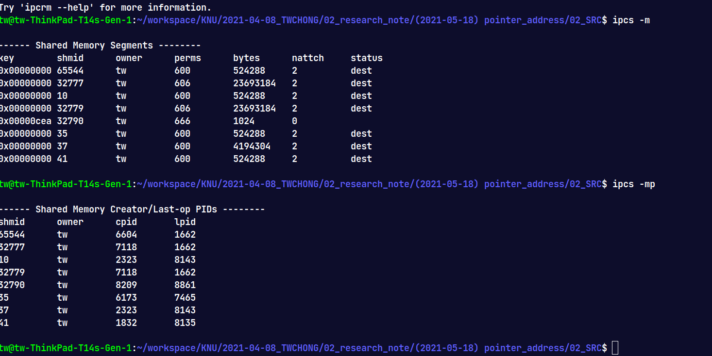
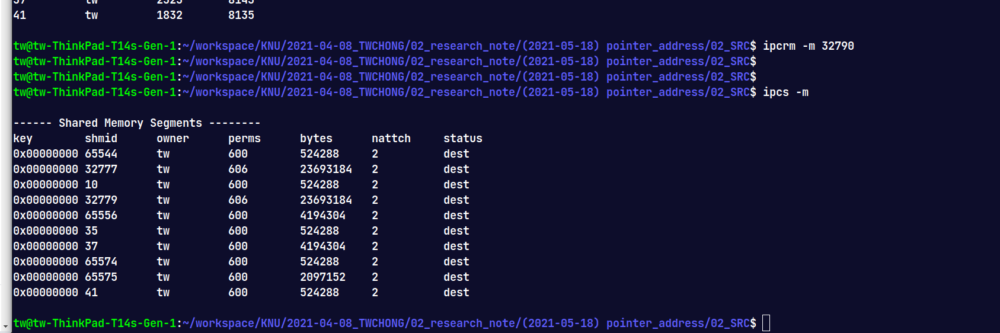
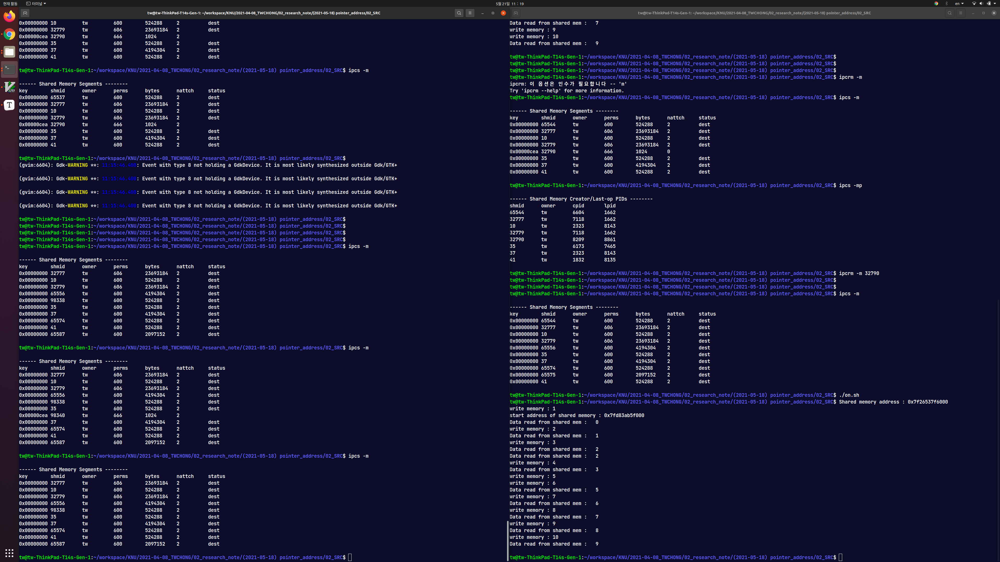

# 포인터 주소를 공유하는 방법

mac에서 sh를 실행시키려면 sh 명령어 사용

# IPC를 이용한 주소값 전송

IPC를 이용하여 프로세스 간의 배열 통신을 하고자 함.

기존에는 배열 전체를 전송하였는데, 배열을 전송하는 시간등을 축소하기 위해 

배열을 포인터로 할당하고 해당 주소만을 송수신하여 데이터 전송 시간을 최소화.


하지만, 두 프로세서가 완전히 동일한 메모리 구조를 가지고 있지 않다면, 메모리 주소를 전송하여

해당 메모리 값을 읽어오더라도 동일한 값을 확인할 수 있을거라는 보장이 없음.


# 공유 메모리?

https://sunder4.tistory.com/317

IPC through shared memory.

https://m.blog.naver.com/demonic3540/221671407431


- 여러 프로세스가 하나의 메모리를 공유하는 방법
- 메로리 자체를 공유하기 때문에 불필요한 데이터 복사의 오버헤드가 발생하지 않아서 빠름
- 만들어진 공유 메모리는 컴퓨터를 다시 시작하거나
- 직접 공유메모리를 해제하지 않는 이상 해당 영역을 사용하는 모든 프로세스가 종료되더라도 유지됨.
- **shmctl() 시스템 콜을 통해 공유 메모리를 제거해주어야 함.**
- 같은 메모리 영역을 여러 프로세스가 공유하기 때문에 동기화 필요...


### 메모리 확인

```
ipcs -m
```




### 메모리 삭제




### 예제 코드

#### writer.c

```c
#include<stdio.h>
#include<unistd.h>
#include<sys/ipc.h>
#include<sys/shm.h>

#define KEY_NUM 3306
#define MEM_SIZE 1024

int main(void){

    int     shm_id;
    void*   shm_addr;
    int     count;

    shm_id = shmget((key_t)KEY_NUM, MEM_SIZE, IPC_CREAT | 0666);

    if(shm_id == -1){
        perror("shmget error : ");
        return 0;
    }   

    shm_addr = shmat(shm_id, (void*)0, 0);

    if((void*)-1 == shm_addr){
        perror("shmat error : ");
        return 0;
    }

    printf("Shared memory address : %p\n", shm_addr);

    count = 0;
	int cnt=0;
    while(cnt < 10)
	{
        sprintf((char*)shm_addr, "%d", count++);
		printf("write memory : %d\n", count);

        sleep(1);
		cnt++;
    }
	
	sleep(2);

	if(-1 == shmdt( shm_addr ))
	{
		printf("Separation shared memory failed\n");
		return -1;
	}

	if(-1 == shmctl( shm_id, IPC_RMID, shm_addr))
	{
		printf("erase shared memory failed\n");
		return -1;
	}

    return 0;
}
```


#### reader.c

```c
#include <stdio.h>      // printf()
#include <unistd.h>     // sleep()
#include <sys/ipc.h>
#include <sys/shm.h>
#include <sys/types.h>

#define  KEY_NUM     3306
#define  MEM_SIZE    1024

int main( void){
   int   shm_id;
   void *shm_addr;

   if ( -1 == ( shm_id = shmget( (key_t)KEY_NUM, MEM_SIZE, IPC_CREAT | 0666)))
   {
      printf( "shared memoty generate failed\n");
      return -1;
   }

    if ( ( void *)-1 == ( shm_addr = shmat( shm_id, ( void *)0, 0))){
        printf( "shared memort add failed\n");
        return -1;
    }

    printf("start address of shared memory : %p\n", shm_addr);

	int cnt=0;
	while( cnt < 10 )
	{
		printf( "Data read from shared mem :   %s\n", (char *)shm_addr);
		sleep( 1);
		cnt++;
	}
	return 0;
}
```


#### result




- 공유 메모리를 통해 프로세스 간의 데이터를 주고 받는 것을 확인할 수 있었음
- 다만, writer는 10까지 쓰고 있는데 reader는 9까지 읽던가
- 수를 read하기 전에 writer가 데이터를 써서 제대로된 값을 못 읽어오는 경우도 발생


- chmctl 함수를 사용해서 사용했던 공유 메모리가 해제되는 것을 확인할 수 있었음.


- 프로세서 간의 공유 메모리 주소는 KEY_MAP 값을 기반으로 탐색하는 것으로 판단됨

