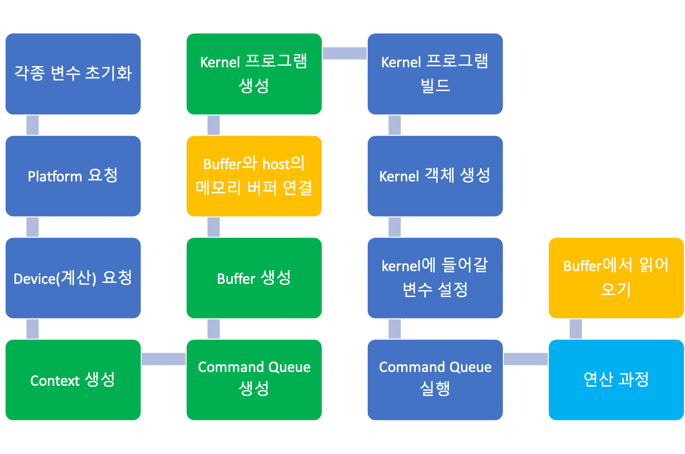

# openCL

- GPU 병렬화 라이브러리

- AMD 프로세서에서 세팅하는 방법

  - https://www.amd.com/ko/support/kb/release-notes/rn-amdgpu-unified-linux-20-20

  - 최신 드라이버로 업데이트

  - ```
    ./amdgpu-install -y --opencl=pa
    ```

  - opencl을 사용하기 위해 위와 같이 세팅하여 인스톨

  - ```
    sudo apt-get install opencl-headers
    sudo apt-get install ocl-icd-libopencl1
    ```

  - 컴파일 시, 헤더를 찾을 수 없는 오류가 발생하여 위 코드를 통해 헤더 파일들을 설치

  - ```
    sudo find / -name "libOpenCL.so"
    ```
  
  - openCL 라이브러리 경로 오류가 발생하여
  
  - 라이브러리 위치를 탐색
  
  - /usr/include/lib 위치가 아니라 /opt/ 아래 항목에 위치하고 있었음
  
  - 이를 위해 makefile을 수정하여 경로를 지정해줌


## 요소

https://m.blog.naver.com/leemino/220005313513

### Platform

- platform은 이종 디바이스들과 하나의 호스트, opencl 프레임 워크로 이루어짐
- 이러한 디바이스들이 사용가능한지, openCL 프레임워크가 해당 시스템에서 사용가능한지를 질의하고 선택하기 위해 사용
- 선택된 디바이스들로부터 context, kernel, queue, buffer등을 생성

### device

- platform을 찾은 후 계산 디바이스를 찾아야 함
- Device란 계산을 수행할 수 있는 유닛들의 집합(compute unit)
- Compute unit은 한개 이상의 processing element로 이루어짐
- GPU, CPU 등이 compute unit

### context

- buffer나 command queue를 할당
- 하나의 context가 어떤 디바이스들과 연관이 있는지 정도만 알면 됨

### program

- program은 kernel의 집합
- dll을 program에 비유하고 내부 함수들을 kernel로 비유

### kernel

- 함수(명령어 집합)을 가지고 있는 객체
- 커널 함수에 인자를 전달해주고 실행하고 결과값을 받는 일체의 행위츷 커널에서 진행

### command queue

- command queue는 커널을 특정 디바이스에서 실행시키기 위한 기능
- context로부터 생성되어지며 관련 디바이스에서 동작
- 비동기나 동기 모델을 프로그래밍할 때 중요한 역할을 가짐

### buffer

- buffer, sub-buffer, image 로 크게 3종류
- 버퍼는 보통 호스트가 가리키는 곳을 참조해서 쓸수도 있고, 디바이스 내 별도 메모리에 생성할 수도 있음
- 보통은 호스트에서 메모리를 생성하고 이를 디바이스 에서 생성한 메모리에 복사하여 커널에서 실행, 다시 호스트의 메모리로 복사하는 과정을 가짐


# OpenCL flowchart



# 분석

## fft.c

```c
cl_int n;	//이미지의 폭 크기 : 512
xm = n*n*sizeof(cl_float2); //= 512 * 512 * 4?

```


butterfly operation

https://kkhipp.tistory.com/138


