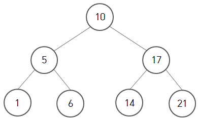

# 이진 탐색 트리

- 이진 자료 구조


- 트리 구조란 그래프의 일종으로 여러 노드가 한 노드를 가리킬 수 없는 구조를 의미함
- 트리에서 최상위 노드를 루트 노드라 함.
- 노드 A가 노드 B를 가리킬 때, A를 B의 부모 노드(parent node), B를 A의 자식 노드(child node)라 함
- 자식 노드가 없는 노드를 잎 노드(leaf node)라 함
- leaf node가 아닌 노드를 내부 노드(internal node)라 함


- 각 노드들에는 값이 있으며
- 노드의 왼쪽 서브 트리에는 그 노드의 값보다 작은 값들을 지닌 노드로 이루어짐
- 노드의 오른쪽 서브트리에는 그 노그의 값보다 큰 값들을 지닌 노드들로 이루어짐
- 좌우 하위 트리는 각각이 다시 이진 탐색 트리여야 함


- 이진 트리의 장점은 룩업 연산, 트리에 있는 특정 노드의 위치를 알아내는 연산이 빠르고 간단하게 처리된다는 점
- log(n) 번 연산을 실행하게 됨
- 데이터가 한 쪽으로 몰릴 경우 연결 리스트와 같아지면서 룩업연산의 속도는 n x n이 됨


- 이진 탐색 트리는 데이터의 삽입, 삭제, 순회의 연산 과정을 가짐


## 예제 코드

```c
//https://digiconfactory.tistory.com/entry/C%EC%96%B8%EC%96%B4-%EC%9D%B4%EC%A7%84-%ED%83%90%EC%83%89-%ED%8A%B8%EB%A6%AC-Binary-Search-Tree-%EB%A7%8C%EB%93%A4%EA%B8%B0-%EC%B6%94%EA%B0%80-%EC%82%AD%EC%A0%9C-%EA%B2%80%EC%83%89
#include <stdio.h>
#include <stdlib.h>
 
#define WELCOME    printf("Hello World!\n\n")
#define LINE       printf("\n\n<*--------------------------------------*>\n\n");
#define show(x)    LINE; printf("          [이진 트리 출력]\n["); showTree(x); printf("]"); LINE;
 
 
typedef struct binary_node {
    
    int data;
 
    struct binary_node *left;
    struct binary_node *right;
 
} BinNode;
 
BinNode *getBinaryNode(void);
void setBinNode(BinNode *ptr, int data, BinNode *left, BinNode *right);
BinNode *addNode(BinNode *ptr, int data);
void showTree(const BinNode *ptr);
void deleteTree(BinNode *ptr);
int getRandomInt(int from, int to);
BinNode *searchTree (BinNode *ptr, int key);
BinNode *deleteNode(BinNode *root, int key);
BinNode *minValueNode(BinNode * node);
 
 
int main(int argc, char const *argv[])
{
    /* code */
    WELCOME;
 
    BinNode *root = NULL;
    BinNode *search = NULL;
 
    for (int i = 0; i < 5; i++)
    {
        root = addNode(root, i*2);
        root = addNode(root, i*(-1));
    }
 
    show(root);
    search = searchTree(root, 8);
    (search != NULL) ? printf("*검색결과 값: %d, 주소: 0x%p", search->data, search):
                       printf("*검색결과 없음");
    LINE;
    deleteTree(root);
 
    printf("\n\n");
 
    /* code */
    root = NULL;
 
    for (int i = 0; i < 10; i++)
    {
        root = addNode(root, getRandomInt(1,50));
    }
    show(root);
    deleteTree(root);
 
    /* code */
    root = NULL;
 
    root = addNode(root, 5);
    root = addNode(root, 1);
    root = addNode(root, 8);
    root = addNode(root, 4);
    root = addNode(root, 2);
    root = addNode(root, 6);
    root = addNode(root, 9);
    root = addNode(root, 7);
    root = addNode(root, 3);
 
    
    show(root);  
    
    // 키값을 삭제한다
    root = deleteNode(root, 5);
    root = deleteNode(root, 8);
    root = deleteNode(root, 3);
 
    
    show(root);
    deleteTree(root);
 
    return 0;
}
 
/*--- 하위 노드중 가장 작은 값을 찾아 준다.  ---*/
 
BinNode *minValueNode(BinNode * node)
{   
    // 커서 노드
    BinNode *cur = node;
 
    while(cur && cur->left != NULL ){
        cur = cur->left;
    }
    // printf("리턴한다 %d 0x%p\n", cur->data, cur);
    return cur;
}
 
/*--- 특정 노드 삭제 일반 포인터로 ---*/
 
BinNode *deleteNode(BinNode *root, int key)
{
 
    // root가 NULL 일 경우. 트리가 비어있을 경우.
    if (root == NULL){
        return root;
    }
    // key 가 노드의 키값보다 작거나 큰 경우[하위트리에 이동]
    if (key < root->data){
        root->left = deleteNode(root->left, key);
    } else if (key > root->data){
        root->right = deleteNode(root->right, key);
    } 
    // 키가 노드의 키값과 같은 경우[삭제]    
    else {
 
 
        // 노드의 자녀가 한개일 경우(왼쪽 아니면 오른쪽)
        // 노드 자녀가 없는 경우도 if문에서 삭제된다.
        if(root->left == NULL){
            BinNode *temp = root->right;
            free(root);
            return temp;
        }
        else if (root->right == NULL){
            BinNode *temp = root->left;
            free(root);
            return temp;
        }
        // 노드의 자녀가 두개일 경우(왼쪽 오른쪽 둘다)
        // 오른쪽 서브트리에서 가장 작은 수를 선택한다.
        // printf("여기\n");
        BinNode *temp = minValueNode(root->right);
 
        // LINE
        // printf("root->data : %d, temp->data : %d at 0x%p\n", root->data, temp->data, temp);
 
        root->data = temp->data;       
        // printf("root->data : %d, temp->data : %d\n", root->data, temp->data);
        root->right = deleteNode(root->right, temp->data);
 
    }
    return root;
}
 
/*--- 키값으로 검색 ---*/
 
BinNode *searchTree (BinNode *ptr, int key)
{
    if(ptr == NULL){
        printf("키값이 (%d)인 노드는 없습니다. [검색실패]\n", key);
        return NULL;
    } else if (key == ptr->data){
        printf("키값이 (%d)인 노드를 반환합니다. [검색성공]\n", key);
        return ptr;
    } else if (key < ptr->data){
        searchTree(ptr->left, key);
    } else {
        searchTree(ptr->right, key);
    }
}
 
/*--- 랜덤 생성 ---*/
 
int getRandomInt(int from, int to)
{
    int random = rand() % (to-from+1) + from;
    return random;
}
 
/*--- 모든 노드의 메모리 해제 ---*/
 
void deleteTree(BinNode *node)
{
    if(node != NULL){
        deleteTree(node->left);
        deleteTree(node->right);
        free(node);
    }
}
 
/*--- 모든 노드의 데이터를 출력 ---*/
 
void showTree(const BinNode *node)
{
    
    if(node != NULL){
        showTree(node->left);
        printf("%d, ", node->data);
        showTree(node->right);
    }
}
 
/*--- 바이너리 노드 동적할당 ---*/
 
BinNode *getBinaryNode(void)
{
    BinNode *newNode = calloc(1, sizeof(BinNode));
 
    newNode->data = 0;      // 초기화 0
    newNode->left = NULL;   // 초기값 NULL
    newNode->right = NULL;  // 초기값 NULL
 
    // printf("*[노드 초기화 완료]\n");
    return newNode;
}
 
/*--- 노드 설정 (left노드, right노드)   --*/
 
void setBinNode(BinNode *node, int data , BinNode *left_child, BinNode *right_child)
{
    node->data = data;
    node->left = left_child;
    node->right = right_child;
}
 
int count = 0;
 
BinNode *addNode(BinNode *node, int data)
{
    
    if (node == NULL){
        node = getBinaryNode();
        setBinNode(node, data, NULL, NULL);
        printf("node 생성완료 (%2d), counter : %d\n",node->data, count++);
    } else if (data == node->data){
        printf("*[이진트리] - 중복된 값은 입력이 안됩니다...\n");
    } else if (data < node->data){
        node->left = addNode(node->left, data);
        // printf("left tree 생성 완료 %d\n", node->left->data);
    } else {
        node->right = addNode(node->right, data);
        // printf("right tree 생성 완료 %d\n", node->right->data);
    }
    // printf("[종료]\n");
    return node;
}
```


## 탐색

- 부모 노드가 왼쪽 자식 노드보다 크거나 같고, 오른쪽 자식 노드보다 작거나 같다는 점을 이용하여 효율적인 탐색이 가능
- 21이라는 노드를 탐색하고자 할 때, 21은 루트 노드 10보다 크므로 왼쪽 서브 트리는 고려할 필요가 없음
- 탐색 영역이 줄어드는 효과를 가짐




## 삽입

- 새로운 노드를 삽입할 경우
- 이를 잎새 노드에 붙이게 됨
- 트리 중간에 삽입할 경우 서브 트리의 속성을 깨뜨릴 수 있어서 새로운 노드는 조건을 만족하는 잎새 노드에 삽입하게 됨


## 삭제

- 삭제를 하기 위해서는 먼저 해당 노드가 어디에 있는 탐색을 해야됨
- 노드를 탐색했다면 다음과 같은 경우가 발생
  1. 삭제하려는 노드가 잎새 노드인 경우
  2. 삭제 노드가 하나의 서브 트리만 가지는 경우
  3. 삭제하려는 노드가 두 개의 서브 트리를 모두 가지는 경우
- 삭제하려는 노드가 잎새 노드인 경우
  - 부모 노드를 찾아서 부모 노드 안의 링크 필드를 NULL로 만들어서 연결을 끊어줌
- 삭제하려는 노드가 하나의 서브 트리만 가지는 경우
  - 68 노드를 삭제하고자 할 때,
  - 35 노드의 오른쪽 링크가 99 노드를 가지도록 수정


- 삭제하려는 노드가 두 개의 서브트리를 모두 가지는 경우
  - https://coding6467.tistory.com/10
  - 18 노드를 삭제하고자 할 때
  - 18 노드를 삭제한 후 35 노드인 부모 노드가 연결할 자식 노드는
  - 왼쪽 서브트리에 있는 값 중 가장 큰 값 또는 오른쪽 서브트리에 있는 값 중 가장 작은 값을 가지고 있는 노드와 연결
  - 22 노드와 부모 노드를 연결할 때
  - 7 노드는 22 노드의 좌측에 26 노드는 우측 트리로 위치시키게 됨


