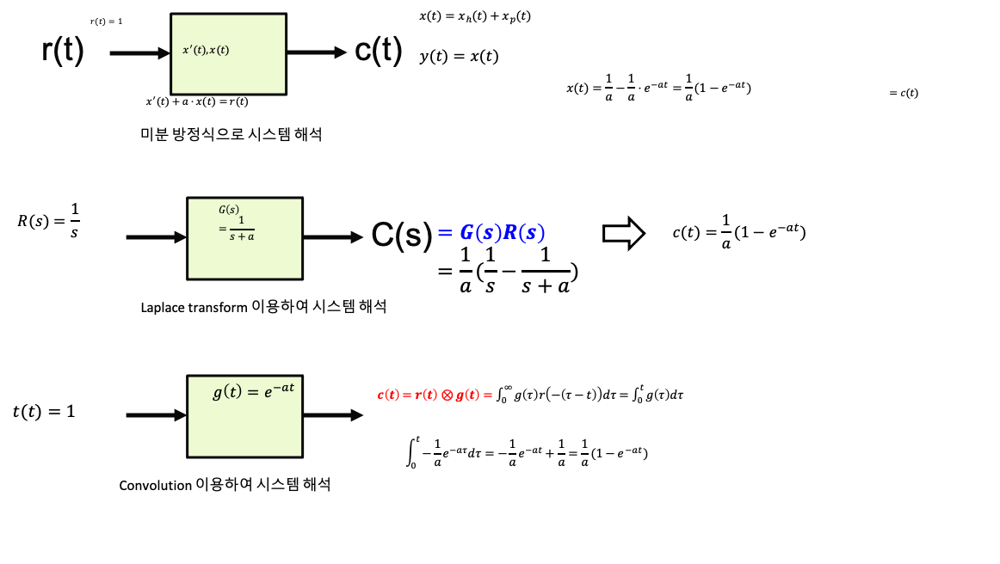
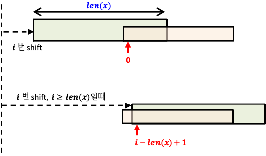
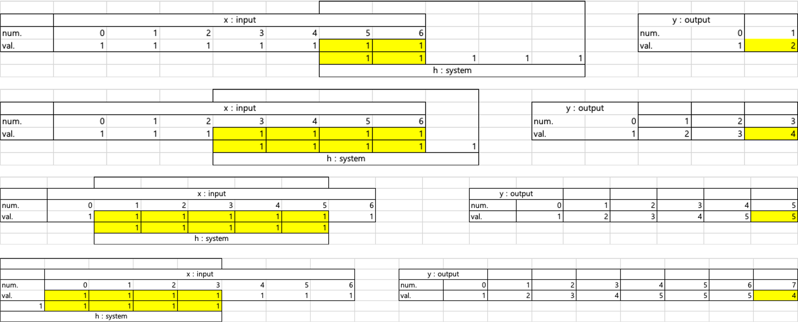
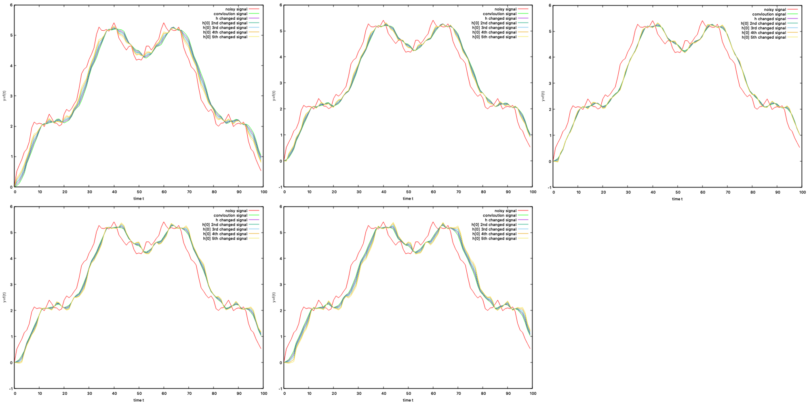

# convolution 

- 합성곱
- 하나의 함수와 또 다른 함수를 반전 이동한 값을 곱한 다음, 구간에 대해 적분하여 새로운 함수를 구하는 수학 연산자


- 두 개의 함수 f와 g가 있을 대, 두 함수의 합성곱을 수학 기호로 표현하면 다음과 같음

$$
f * g
$$

- 합성곱 연산은 두 함수 f,g 가운데 하나의 함수를 반전, 쉬프트시키면서 다른 하나의 함수와 곱한 결과를 적분하는 것을 의미

$$
(f*g)(t) = \int_{-\infty}^\infty f(\tau)g(t - \tau)d\tau
$$


- Linear time invariant system 상에서 이전 값과 현재 값을 연산하기 위해 주로 사용되는 연산
- 두 신호의 합성

$$
y[n] = h[n] * x[n] = \sum_{k=-\infin}^\infin h[k] x[n - k]
$$


## 소스코드

```c++
void convolution(float h[], int len_h, float x[], int len_x, float* y, int len_y)
{
	int i, j, h_start, x_start, h_end;

	for(i = 0; i<len_y; i++)
	{
		/*
		*	var1 ? var2 : var3
		*	--> var is true(1), value is var2
		*	--> var is false(0), value is var3
		*/
		h_start = i >= len_x ? i - len_x +1 : 0;
		/*
		*	len_x = 7
		*	h_start range : if i = 7~11 -> i - len_x +1 = 1~6	
		*/
		h_end	= i >= len_h ? len_h -1		: i;
		/*
		*	len_h = 5
		*	h_end range : if i = 5~11 -> len_h -1 = 4
		*/
		x_start = i >= len_x ? len_x -1		: i;
		/*
		*	len_x = 7
		*	x_start range : if i = 7~11 -> len_x-1 = 6
		*/

		for(j = h_start; j<=h_end; j++)
		{
			y[i] += h[j] * x[x_start];
			x_start--;
		}
		/*
		i = 0, h_start = 
		*/
	}
}
```


## convolution 방법





- 입력 값들
- 시스템 값들
- 입력 값들을 역순으로 변환
- 역순으로 변환된 입력값이 순차적으로 시스템으로 입력됨
- 시스템의 값과 입력값이 만나게 되면 연산되어 출력 값이 생성됨




## coeffient 변화에 따른 출력의 변화

```c++
	for(int i=0; i<5; i++)
	{
		for(int j=0; j<len_y; j++)
		{
			resu[i][j] = 0;
		}
		h[0] -= 0.025;
		h[1] -= 0.025;
		h[2] -= 0.025;
		h[3] -= 0.025;
		h[4] += 0.1;
		convolution(h, len_h, polynomial, len_x, resu[i], len_y);
	}
```

- h의 값을 코드와 같이 순차적으로 변경시켜봄
- h의 합이 1을 넘을 경우 거의 동일한 출력을 보여서 한 h 값이 증가할 경우 
- 다른 h 값은 다소 감소하도록 구현



- 순서대로 h[0]부터 h[4]까지 증가시켜가면서 그래프의 변화를 확인
- 눈에 확띄는 변화가 발생하지는 않았지만, 
- 진폭이 작은 신호의 노이즈 값들은 h 값의 변화에 따라 그 변화를 확인은 할 수 있었음

### 최대값을 무시하고 h 값을 변화

![h[0]의 변화에 따른 출력 변화](image/coeffi_1/[coeffi]h0_0.1_0.6.png)

h[0]의 변화에 따른 출력의 변화

![h[1]의 변화에 따른 출력의 변화](image/coeffi_1/[coeffi]h1_0.1_0.6.png)

h[1]의 변화에 따른 출력의 변화

![h[2]의 변화에 따른 출력의 변화](image/coeffi_1/[coeffi]h2_0.2_0.7.png)

h[2]의 변화에 따른 출력의 변화

![h[3]의 변화에 따른 출력의 변화](image/coeffi_1/[coeffi]h3_0.2_0.7.png)

h[3]의 변화에 따른 출력의 변화

![h[4]의 변화에 따른 출력의 변화](image/coeffi_1/[coeffi]h4_0.4_0.9.png)

h[4]의 변화에 따른 출력의 변화

- h 값 별로 값이 달라짐에 따라 출력되는 그래프의 변화를 확인
- 특히 0->4로 갈수록 그래프가 미세하게 우측으로 쉬프트되며
- 두 봉우리 모양의 그래프 또한 위가 둥근 형태에서 직선 형태로 변화해가는 점을 확인할 수 있었음
- 각 h 값이 증가할 수록 진폭은 증가하는 형태를 띔
- 이는 h 값의 총 합이 1을 넘기때문으로 보임