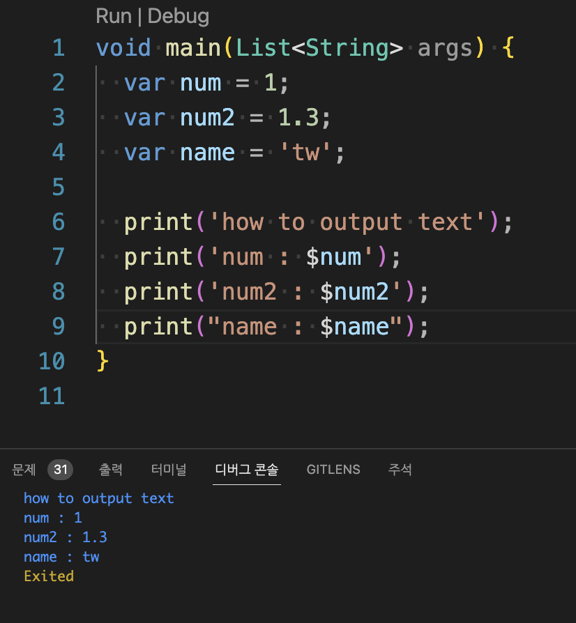
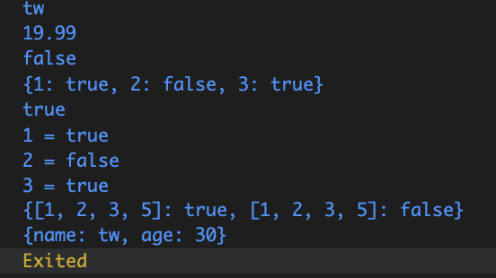
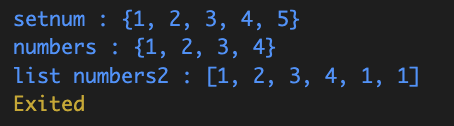

# Study DART

THANKS to [nomadcoder](https://nomadcoders.co/)

## dart

### 다트의 기초

- 두 개의 컴파일러를 통해 OS에 맞게 컴파일됨
  - Dart web : drat -> javascript
  - Dart Native : 그 외 OS의 app으로 컴파일

### dart 개발환경 구축

- VSCODE의 dart extension 이용
  - [참조 사이트](https://docs.dart.dev/get-started/install/macos)
  - 참조하여 개발환경 세팅 필요
- 또는 [dartpad](https://dartpad.dev/?) 웹사이트를 이용한 코딩 가능

## dart 내용 정리

### print

- example

```dart
void main() {
  var num = 1;
  var num2 = 1.3;
  var name = 'tw';

  print('how to output text');
  print('num : $num');
  print('num2 : $num2');
  print("name : $name");
}
```

- result



### Variable

#### type

```dart
void main(){
    var name = 'tw';
    String name1 = 'tw';

    bool checked = false;

    int n1 = 1;
    double n2 = 2.34;
    num n3 = 1;
    n3 = 20.12;
}
```

- 일반적으로 var 변수명을 사용하면, 입력한 값에 따라 자동적으로 변구 타입을 지정해 줌.
- String, int, double, float, bool 등 일반 변수 타입도 사용 가능
- num형의 데이터는 숫자에 관한 변수형으로 int, double 형에 상관 없이 숫자라면 값을 입력받을 수 있음

##### String

```dart
var l = ['1', '2'];
var l2 = [
    '3',
    '4',
    '5',
    for (var i in l)
    "$i",
];    // ["3","4","5", "1","2"]
```

##### dynamic Type

```dart
void typeChecker(var type) {
  if (type is String) {
    print('TYPE is String : $type');
    // type.isEmpty;
  } else if (type is int) {
    print('TYPE is int : $type');
    // type.isEven;
    // type.isOdd;
    // type.isInfinite;
  } else if (type is bool) {
    print('TYPE is bool : $type');
    // type.hashCode;
  } else if (type is double) {
    print('TYPE is double : $type');
    // type.isInfinite;
    // type.isNaN;
  } else if (type is Float) {
    print('TYPE is Float : $type');
    // type.hashCode;
  }
}

void main(){
    var name;
    name = 'tw';
    typeChecker(name);
    name = 1;
    typeChecker(name);
    name = true;
    typeChecker(name);
}
```

- 별도의 선언 없이 var만 선언할 경우
- var은 dynamic 타입을 가지게 됨.
- 입력되는 값의 타입에 따라 선언한 변수의 타입이 변경됨

##### NULL safety

```dart
void main(){
    String? name = 'tw';
    name = null;
    if(name != null){
        if(name.isNotEmpty){
            // do something
        }
    }
    //or
    name?.isNotEmpty;
}
```

- 변수의 null 값에 의한 오류를 방지하기 위한 기능.
- 일반적으로 null 값이 있는 변수가 있을 경우 컴파일 에러가 발생하며,
- 특정 변수에 null 값을 입력하거나 사용하고자 할 경우 변수 선언 시, ?을 추가하여 선언할 필요가 있음.

##### final type

```dart
void main(){
    var name = 'tw';
    // name = 1;     // ERROR
    // 선언 시, String 타입의 값을 입력하면서 고정되었기 때문에
    // 1 값을 입력하면, 타입 오류게 의한 에러가 발생함.

    final name2 = 'twtw';
    // name2 = 'tw2';    //ERROR
}
```

- 일반적으로 변수 선언 시, 변수 값을 입력하게 되면,

- 해당 변수의 타입은 고정되게 됨.

- final 타입은 선언 시, 한 번만 변수의 값을 입력할 수 있도록 선언하는 타입

- 이후 변수값을 변경하고자 할 경우 에러를 출력하게 됨.

##### late type

```dart
void main(){
    late final String name;
    // do somethings...
    // do somethings END...
    name = 'twtw';
}
```

- 일반적으로 final 타입과 같이 사용하는 타입
- final 타입은 한 번만 변수의 값을 입력할 수 있는데,
- late 선언을 추가함으로서, 변수 선언 이후에 한 번만 변수 값을 입력할 수 있음

##### const type

```dart
void main(){
    const name = 'tw';
    const nam2 = someAPI_VALUE();    // ERROR
}
```

- final 타입과 유사하지만,
- const 타입은 compile 시, 해당 값이 특정 값을 가지고 있어야 함.
- 위 코드와 같이 어떠한 API로부터 값을 받을 경우에는 에러가 발생
- 사용자로부터 입력받거나, api로부터 값을 받을 경우에는 final 타입으로 선언할 필요가 있음.

#### list

- example

```dart
var l = [1,2,3,4];
// 마지막 항에 ,을 추가하면,
// 자동 보정시 다음과 같이 정리해줌
// var l = [
//    1,
//    2,
//    3,
//    4,
//  ];
```

- 항목 추가 방법

```dart
var l = [1,2,3,4,];
var.add(5);
var.add(5);
var.add(5);    // {[1,2,3,4,5,5,5]}
```

- list 정의 시, 조건 할당 방법

```dart
bool condition = false;
var l_num = [
    1,
    2,
    3,
    4,
    if (condition) 5,
];    // condition 값이 true이면 5값이 입력됨.
```

##### warning

공식문서를 찾아보니 filled로 초기화 하면 생성된 모든 요소들은 동일한 fill값을 공유한다는 사실을 알아냈다.
아래 코드를 보면 shared[0]에만 499를 추가했지만 shared[1], shared[2]에도 499라는 값이 추가된 결과를 알 수 있다. 이는 주소 값을 공유하기 때문이다.

#### Map

```dart
Map<type, type> name;
```

- 첫 번째 요소는 key
- 두 번째 요소는 value

- example

```dart
void main() {
  var map1 = {
    'name': 'tw',
    'xp': 19.99,
    'superpower': false,
  };

  print(map1['name']);    // tw
  print(map1['xp']);      // 19.99
  print(map1['superpower']);    // false

  Map<int, bool> map2 = {
    1: true,
    2: false,
    3: true,
  };

  Map<List<int>, bool> map3 = {
    [1, 2, 3, 5]: true,
  };

  print("$map2");    // {1:true, 2: false, 3: true}
  if (map2.containsKey(1)) print(map2[1]);    // true
  for (final e in map2.entries) {
    print('${e.key} = ${e.value}');
  }
    // 1 = true
    // 2 = false
    // 3 = true

  map3[[1, 2, 3, 5]] = false;
  print("$map3");    // {[1,2,3,5]: true}

  var map4 = Map();
  map4['name'] = 'tw';
  map4['age'] = 30;
  print(map4);    //{name: tw, age: 30}
}

```

- 결과



#### Set

- 배열 관련 변수
- 모든 항목이 다를 경우에 유용
- add 등으로 항목 추가 시, 기존 항목에 동일한 값이 있다면 추가 되지 않음

```dart
Set<int> setnum = {1, 2, 3, 4};
setnum.add(1);
setnum.add(2);
setnum.add(5);
  
var numbers = {1, 2, 3, 4};
// same set
numbers.add(2);
numbers.add(1);
numbers.add(3);

print('setnum : $setnum');
print('numbers : $numbers');
// set을 사용하면 같은 값을 추가하더라도
// 자체적으로 추가되지 않음.
// List<int> numbers2 = [1, 2, 3, 4];
var numbers2 = [1, 2, 3, 4];
// same list
numbers2.add(1);
numbers2.add(1);
print('list numbers2 : $numbers2');
// list을 사용하는 경우
// add항목이 중복되더라도 추가됨
```



### FUNC

#### func 명료화

- c/c++와 같이 함수를 외부에 정의해서 사용할 수 있음
- 비교적 함수 내부가 명료하고 return 값이 있다면, 아래 예제와 같이 한 줄로 코드를 작성하여
- 가독성을 올릴 수 있음

```dart
void hello(String name){
    print("Hello $name nice to meet you");
}

String hello2(String name) => "Hello $name nice to meet you";

int sum(int a, int b) => a + b;

void main(){
    hello("tw");            // Hello tw nice to meet you
    print(hello2("twtw"));  // Hello twtw nice to meet you
    print(sum(1,2));        // 3
}
```

#### parameter

- 일반적인 경우
- 함수 선언 시, 입력 값이 없으면, null safety에 의해 오류가 발생함.
- positional arguments
  
```dart
String sayHello(String name, int age, String con){
    return "Hello $name, you are $age, and you come from $con";
}

void main(){
    print(sayHello("tw", 20, "korea"));
    // Hello tw, you are 10, and you come from korea
}
```

- 함수 정의 시, 기본 값을 할당하여 null safety 에러를 예방
- named arguments

```dart
String sayHello({
    String name = "none",
    int age = 99,
    String con = "WHERE?",
}) {
    return "Hello $name, you are $age, and you come from $con";
}

void main(){
    print(sayHello());
    // Hello none, you are 99, and you come from WHERE?
    print(sayHello("tw", 20, "korea"));
    // Hello tw, you are 10, and you come from korea
}
```

- 입력 값이 누락되더라도 기본 값을 입력하고 함수를 명료화
- optional positional arguments

```dart
String sayHello(String name, int age, [String? country = 'any']) =>
    "Hello $name, you are $age, and you come from $country";

void main() {
  //optional positional parameters
  print(sayHello('tw3', 35));
  // Hello tw3, you are 35 and you come from any
}
```

- 위와 같은 코드는 함수의 입력 값을 정확히 알 필요가 있음
- dart에서는 이를 소스코드 작성 중에 쉽게 알 수 있도록 지원하고 있음

```dart
String sayHello({
  required String name,
  required int age,
  required String country,
}) {
  return "Hello $name, you are $age, and you come from $country";
}

void main() {
  // 코드 작성 시, 해당 변수를 요구하며, 자동 완성 됨
  print(sayHello(name: 'name', age: 20, country: 'mango'));
  // Hello name, tou are 20, and you come from mango
}
```

### QQ operator

#### var?

```dart
String capitalizeName(String name) => name.toUpperCase();

String capitalizeName2(String? name) {
  if (name != null) {
    return name.toUpperCase();
  }
  return 'NONE';
}

void main(){
  print(capitalizeName('twwt'));    // twwt
  print(capitalizeName2('tw'));     // tw
  print(capitalizeName2(null));     // NONE
}
```

- 함수 명료화

```dart
String capitalizeName(String? name) =>
    name != null ? name.toUpperCase() : 'NONE';

String capitalizeName2(String? name) => name?.toUpperCase() ?? 'None3';
// 좌측 항이 null이면 우측 항의 값을 리턴함

void main(){
  print(capitalizeName('twwt'));    // twwt
  print(capitalizeName(null));      // NONE

  print(capitalizeName2('twwt'));    // twwt
  print(capitalizeName2(null));      // NONE3
}
```

#### ?=

- 해당 변수가 null인지 확인하고 값을 할당
- null이면 값을 할당하고
- null이 아니면 값을 할당하지 않음

```dart
void main(){
  String? name;
  name ??= 'twwt';    // null이기 때문에 값이 할당됨
  name ??= 'ano';    // twwt 값이 입력되어서 값이 할당되지 않음
  print(name);    //twwt
}
```

### class

- c/c++와 동일한 형태로 정의하여 사용

```dart
class Player {
  String name = 'tw';
  int xp = 1500;

  void sayHello() {
    // 만약 해당 함수에서 선언한 변수명이 같은 경우에는
    // print("Hi my name is ${this.name}"); 으로 사용
    print("Hi my name is $name");
  }
}

class Player_f {
  final String name = 'tw';
  int xp = 1500;
}

void main() {
  var player = Player();
  // new를 꼭 사용할 필요는 없음...
  // var player = new Player();
  print(player.name);    // tw
  player.name = 'tw2';
  print(player.name);    // tw2

  player.sayHello();    // Hi my name is tw2

  var player2 = Player_f();
  print(player2.name);    // tw
  // player2.name = "twtw";  //error for final var.
}
```

#### construction

- class의 변수 값을 class 선언 시 할당하도록,
- late final로 선언
- class 선언 시에만 초기화 가능하며
- 이후 해당 값을 변경하고자하면 오류로 run 되지 않음

```dart
class Player {
  late final String name;
  late int xp;

  Player(String name, int xp) {
    this.name = name;
    this.xp = xp;
  }

  void sayHello() {
    print("Hi my name is $name");
  }
}

void main() {
  var player = Player("name,tw", 1500);
  // print(player.name);
  var player2 = Player("name, twwt", 200);
  player.sayHello(); // Hi my name is name, tw
  player2.sayHello(); // Hi my name is name, twwt

  // player.name = 'twtw';  // ERROR!
}
```

#### 입력 명료화

```dart
class Player {
  final String name;
  int xp;

  Player(this.name, this.xp); // this로 바로 할당할 수 있음

  void sayHello() {
    print("Hi my name is $name");
  }
}

void main(){
  var p = Player("twwt", 2000);
  p.sayHello();    // Hi my name is twwt
}
```

#### required

```dart
class Player {
  final String name;
  int xp;
  String team;
  int age;

  Player({
    required this.name,
    required this.xp,
    required this.team,
    required this.age,
  });

  void sayHello() {
    print("Hi my name is $name");
    print("\txp : $xp");
    print("\tteam : $team");
    print("\tage : $age");
  }
}

void main(){
  var p = Player(
    name: "twtww2",
    xp: 1000,
    team: "red",
    age: 30,
  );

  p.sayHello();
  // Hi my name is twtww2
  //    xp : 1000
  //    team : red
  //    age : 30
}
```

#### named constructor

```dart
class Player_C {
  final String name;
  int xp, age;
  String team;

  Player_C({
    required this.name,
    required this.xp,
    required this.team,
    required this.age,
  });

  // 특정 값을 일정하게 할당하고자 할 경우
  // 본 함수는 team 값을 일정하게 할당
  Player_C.createBluePlayer({
    required String name,
    required int age,
  })  : this.age = age,
        this.name = name,
        this.team = 'blue',
        this.xp = 0;

  Player_C.createRedPlayer(String name, int age)
      : this.age = age,
        this.name = name,
        this.team = 'red',
        this.xp = 0;

  void sayHello() {
    print("Hi my name is $name");
    print("\txp : $xp");
    print("\tteam : $team");
    print("\tage : $age");
  }
}

void main(){
  var blu_player = Player4_color.createBluePlayer(
    name: "tw(blue)",
    age: 30,
  );

  var red_player = Player4_color.createRedPlayer("tw(red)", 30);

  blu_player.sayHello();
  red_player.sayHello();
}

//Hi my name is tw(blue)
//    xp : 0
//   team : blue
//    age : 30
//Hi my name is tw(red)
//    xp : 0
//    team : red
//    age : 30
```

#### using Json format

- 특정 API 등으로부터 JSON 형태로 데이터가 입력될 경우
- 아래와 같이 class를 선언하여 입력 값으로 사용할 수 있음

```dart
class cl_json {
  final String name;
  int xp;
  String team;

  // dynamic 선언하여
  // 입력 변수의 타입에 상관없이 입력 받을 수 있음
  cl_json.fromJson(Map<String, dynamic> jsonType)
      : name = jsonType['name'],
        xp = jsonType['xp'],
        team = jsonType['team'];

  void sayHello() {
    print("Hi[json] my name is $name");
    print("\txp : $xp");
    print("\ttteam : $team");
  }
}

void main(){
  var apiData = [
    {
      "name": "tw",
      "team": "red",
      "xp": 0,
    },
    {
      "name": "tw2",
      "team": "red",
      "xp": 0,
    },
    {
      "name": "tw3",
      "team": "red",
      "xp": 0,
    },
  ];

  apiData.forEach((jsonType) {
    var playerJ = cl_json.fromJson(jsonType);
    playerJ.sayHello();
  });
}
```

- 결과

```powershell
Hi[json] my name is tw
    xp : 0
    team : red
Hi[json] my name is tw2
    xp : 0
    team : red
Hi[json] my name is tw3
    xp : 0
    team : red
```

#### cascade notation

```dart
class Player {
  String name;
  int xp;
  String team;

  Player({required this.name, required this.xp, required this.team});

  void sayHello() {
    print("Hi[json] my name is $name");
    print("\txp : $xp");
    print("\tteam : $team");
  }
}

void main(List<String> args) {
  // 기본 값 할당 방법
  var tw = Player(name: 'tw', xp: 1200, team: 'red');
  tw.name = 'tw-1';
  tw.xp = 10;
  tw.team = 'blue';
  tw.sayHello();

  // 선언 시 각 값이 입력되었지만,
  // 이후 값 할당에 의해 값이 변경됨
  var tw2 = Player(name: 'tw2', xp: 100, team: 'blue')
    ..name = "tw2-2"
    ..xp = 10000
    ..team = 'red'
    ..sayHello();

  // tw2을 할당 받고
  // 이후 값을 수정
  var potato = tw2
    ..name = 'potato'
    ..xp = 2003
    ..team = 'black'
    ..sayHello();
}
```

- 결과

```powershell
Hi my name is tw-1
    xp : 10
    team : blue
Hi my name is tw2-2
    xp : 10000
    team : red
Hi my name is potato
    xp : 2003
    team : black
```

### enum

```dart
enum TEAM {red, blue}

void main(){
  TEAM t = TEAM.red;
  print(t);    //TEAM.red

  if (t == TEAM.red)    // true
    print("true");
  else
    print("false");
}
```

### something to dart
