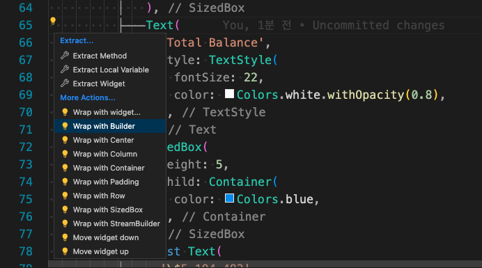

# Flutter

[Source](https://nomadcoders.co/)

## make project

```powershell
# move project directory
cd [dir]
flutter create [project_name]
```

## setting

### user settings in vscode

- 자동으로 const 항목에 const를 추가

```json
// add
"editor.codeActionsOnSave": {
  "source.fixAll": true
 },
//-------
 "dart.openDevTools": "flutter",
 "latex-workshop.view.pdf.viewer": "tab",
 "[latex]": {
  "editor.defaultFormatter": "James-Yu.latex-workshop"
 },
 "[tex]": {
 },
```

- 소스코드 가이드라인 생성

```json
"dart.previewFlutterUiGuides": true,
```

- code Action with VSCode
- 단축키 : [ cmd + . ]



## FUNC

### get

```dart
  Future<String> get _localPath async {
    final directory = await getApplicationDocumentsDirectory();
    return directory.path;
  }
```

### List sort

- 사용자의 정의에 따라 list 내의 항목을 정렬할 수 있음.
- split(RegExp(r'[(-)]'))는 list 내 원소의 ( ) 사이의 값을 기준으로 추출함.

```dart
list.sort(
    (a, b) {
        List<String> la = a.split(RegExp(r'[(-)]'));
        List<String> lb = b.split(RegExp(r'[(-)]'));
        if (int.parse(la[1]) > int.parse(lb[1])) {
            return 1;
        } else {
            return -1;
        }
    },
};
```

### how to make widget using vscode

```dart
stl + 자동완선
```

- vscode의 자동완성 기능을 사용하여
- 편리하게 statefulwidget이나 statefulesswidget을 생성할 수 있음

### using Package

#### ex) url_launcher

[참조](https://pub.dev/packages/url_launcher)

##### install

- terminal

```powershell
flutter pub add url_launcher
```

- flutter

```dart
// add pubspec.yaml
dependencies:
  url_launcher: ^6.1.9
```

##### configuration

- 설정을 해주어야 하는 패키지가 있음
- ios, 안드로이드 등 운영체제 별로 설정해주어야 함.
- ios : /project/ios/Runner/Base.Iproj/Info.plist에 추가
- 추가 후, 디버깅 중이라면 디버깅을 새로해야함.

### class

#### implements

- 다른 클래스에서 정의된 변수값을 인터페이스로 사용
- 클래스의 멤버 변수, 함수, 생성자 등의 구현이 필수적임

```dart
abstract class Person {
    Person(this.name);
    final String name;
    String sex();
    String age();
    String eat() => '$name eats nothing';
    String say() => '$name says somethigs';
}

class SomePerson implements Person{
    @override
    String get name => 'who';

    @override
    String age() => '$name is 20';

    
}
```

#### extends

## PACKAGE

### network_info_plus

- wifi 네트워크 정보 획득

[링크](https://pub.dev/packages/network_info_plus)

## Authorization

### mac OS

- 권한을 부여해주어야 파일을 제어하거나 할 수 있음
- 해당 폴더에 추가하고자 하는 권한을 아래 리스트에서 찾아서 추가

```powershell
/project/macos/Runner/DebugProfile.entitlements
```

```json
<key>com.apple.security.files.user-selected.read-write</key>
```

#### list

[리스트 링크](https://developer.apple.com/documentation/bundleresources/entitlements/app_sandbox)
