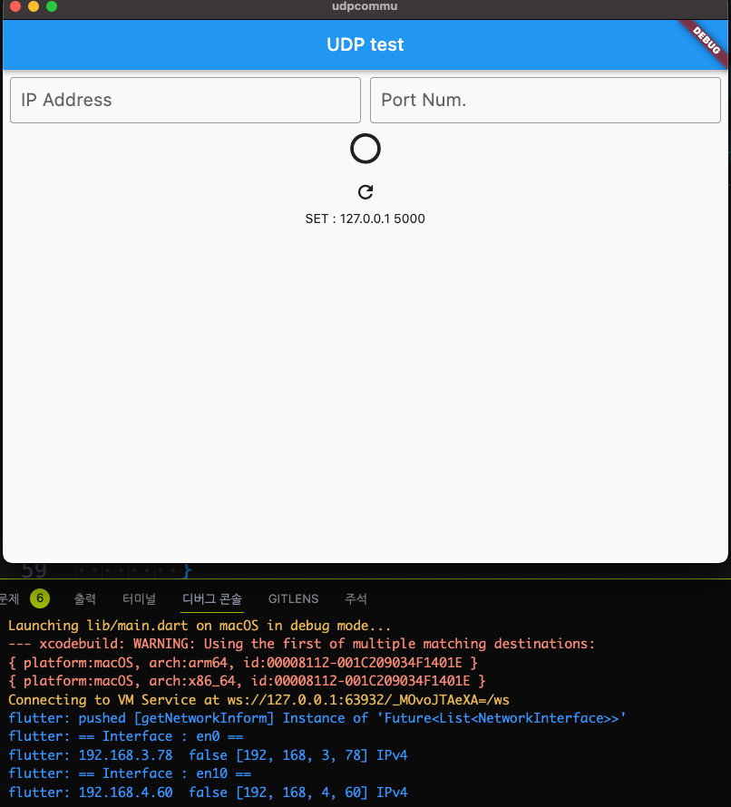

# flutter network

## example

### NetworkInterface

#### flutter native

```dart
  void getNetworkInform() async {
    print("pushed [getNetworkInform] ${NetworkInterface.list()}");

    for (var ifc in await NetworkInterface.list()) {
      print('== Interface : ${ifc.name} ==');
      for (var addr in ifc.addresses) {
        print(
            '${addr.address} ${addr.host} ${addr.isLoopback} ${addr.rawAddress} ${addr.type.name}');
      }
    }
  }
```

##### result



### flutter native 2

```dart
void getNetworkInform() async {
    try {
      var list = await NetworkInterface.list(
        includeLoopback: true,
        type: InternetAddressType.IPv4,
      );
      for (var i = 0; i < list.length; i++) {
        print(list[i].name);
        print(list[i].addresses[0].address);
      }
    } catch (e) {
      print('exception');
    }
  }
```

- ip 정보를 가져오는 것을 확인
- mac OS 시뮬레이터에서만 동작함.

### r_get_ip

[ref.](https://pub.dev/packages/r_get_ip)

### Network_tools

[ref.](https://pub.dev/packages/network_tools)

```dart
import 'package:network_tools/network_tools.dart';
  Future getNetworkInform() async {
    print('pushed');
    for (final ActiveHost activeHost in await MdnsScanner.searchMdnsDevices()) {
      final MdnsInfo? mdnsInfo = await activeHost.mdnsInfo;
      print(
        'Address: ${activeHost.address}, Port: ${mdnsInfo!.mdnsPort}, ServiceType: ${mdnsInfo.mdnsServiceType}, MdnsName: ${mdnsInfo.getOnlyTheStartOfMdnsName()}, Mdns Device Name: ${mdnsInfo.mdnsSrvTarget}',
      );
    }
  }
```

- mac OS 시뮬레이터에서 동작 확인
- 연결된 모든 네트워크 인터페이스를 검색하기 때문에
- 다소 검색에 오래걸리지만,
- 로컬 연결된 usb 이더넷 포트도 검색됨을 확인

## Error

### operation not permitted

#### mac OS

- add config text in files

```powershell
/flutter-project/macos/Runner/DebugProfile.entitlements
and
/flutter-project/macos/Runner/Release.entitlements
```

```json
 <key>com.apple.security.network.client</key>
 <true/>
```

### /Pods/Manifest.lock: No such file or directory

```powershell
cd /project-dir/macos/
pod install
```
